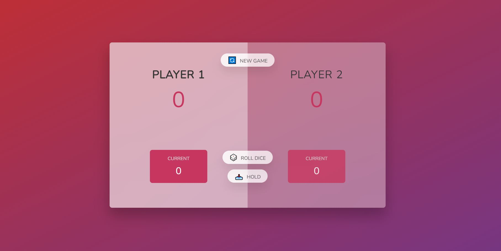
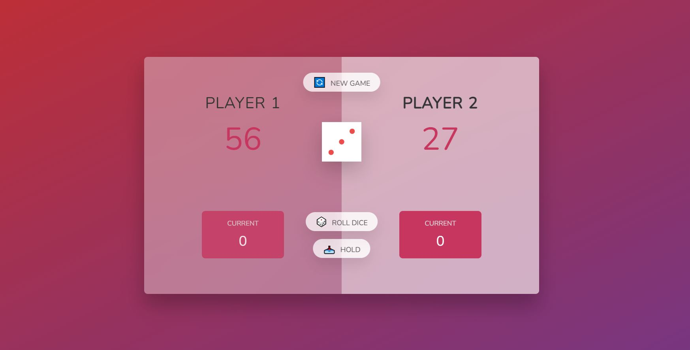
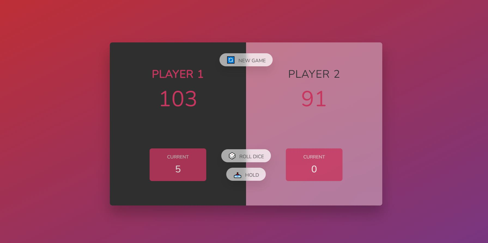

# Pig Game

Pig Game is a practice project from the JavaScript Course "Beginner to Expert" by Jonas Schmedtmann.

HTML and CSS was already provided by the course instructor. I implemented the JavaScript.

The game is not optomized for mobile devices.

## Table of contents

- [Overview](#overview)
  - [About the game](#about-the-game)
  - [Screenshot](#screenshot)
  - [Links](#links)

## Overview

### About the game

Players take turns rolling the die.

Each player has two scores, total score and current score.

For a player to win the game they need to accumulate a total score of 100.

To do this each player takes turns rolling the die.

During each turn a player can roll the dice as many times as they like. Each die roll is added to their current score.

If a player rolls a 1, their current score is reset to 0 and the turn is passed to the next player.

A player can choose to hold their score before a 1 is rolled. This score is then banked and added to their total score.

Once a player reaches a total score of 100 they are declared the winner.

A new game can be commenced by pressing the "New Game" button which resets the game to the initial state.

### Screenshot

### Links

- Solution URL: [GitHub](https://github.com/Roneeey/RudeRatingWidget)
- Live Site URL: [GitHub Pages](https://roneeey.github.io/PigGame/)
